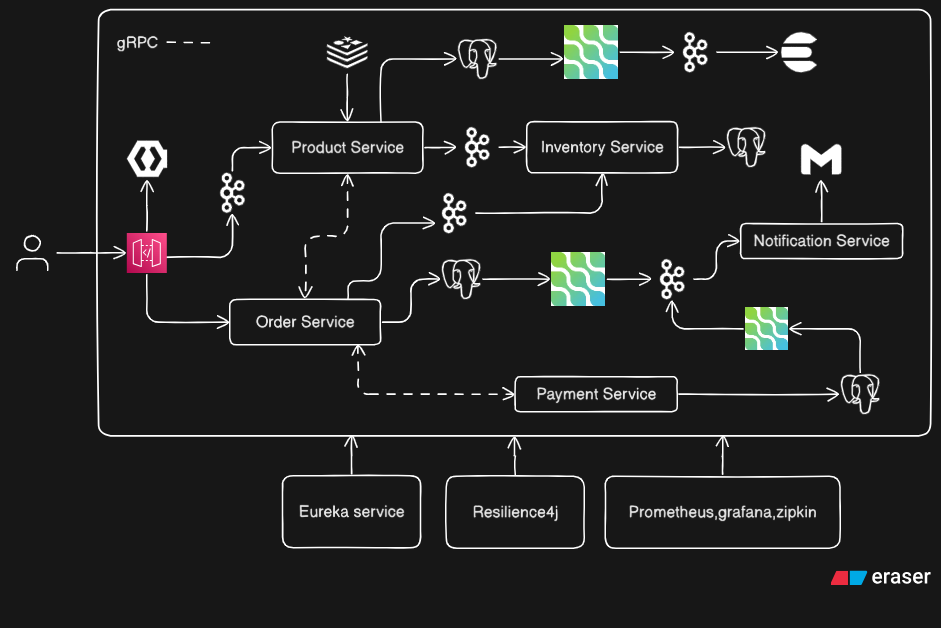

## Order Management System Microservices Overview


A comprehensive enterprise-grade Order Management System built using microservices architecture. This system demonstrates modern software design patterns, distributed systems principles, and event-driven architecture for handling complex e-commerce order workflows.

## 📋 Table of Contents

- [System Architecture](#system-architecture)
- [Microservices Overview](#microservices-overview)
- [Technology Stack](#technology-stack)
- [Key Features](#key-features)
- [Getting Started](#getting-started)
- [Architecture Patterns](#architecture-patterns)
- [Infrastructure Components](#infrastructure-components)
- [API Gateway](#api-gateway)
- [Service Discovery](#service-discovery)
- [Event Streaming](#event-streaming)
- [Observability](#observability)
- [Contributing](#contributing)
- [License](#license)

## 🏗️ System Architecture



The system follows a distributed microservices architecture with the following design principles:

- **Loose Coupling**: Services are independently deployable and maintainable
- **High Cohesion**: Each service focuses on a specific business capability
- **Event-Driven**: Asynchronous communication using event streaming
- **Fault Isolation**: Service failures don't cascade across the system
- **Scalability**: Individual services can scale based on demand

## 🔧 Microservices Overview

### Core Services

#### 1. **API Gateway**
- Central entry point for all client requests
- Request routing and load balancing
- Authentication and authorization
- Rate limiting and throttling
- Protocol translation (HTTP/REST)

#### 2. **Auth Service**
- User authentication and authorization
- JWT token generation and validation
- Role-based access control (RBAC)
- Security policy enforcement

#### 3. **Order Service**
- Order creation and management
- Order lifecycle tracking
- Order validation and processing
- Integration with inventory and payment services

#### 4. **Product Service**
- Product catalog management
- Product information retrieval
- Product search and filtering
- Inventory integration

#### 5. **Inventory Service**
- Real-time inventory tracking
- Stock availability checks
- Inventory reservation and release
- Multi-warehouse support

#### 6. **Payment Service**
- Payment processing
- Multiple payment gateway integration
- Transaction management
- Payment reconciliation

#### 7. **Notification Service**
- Multi-channel notifications (Email, SMS, Push)
- Event-driven notification triggers
- Template management
- Delivery status tracking

### Infrastructure Services

#### 8. **Discovery Server** (Eureka)
- Service registration and discovery
- Health monitoring
- Load balancing
- Service mesh coordination

## 💻 Technology Stack

### Core Technologies


### Communication & Messaging


### Service Discovery & Gateway


### Database


### Containerization & Orchestration


### Observability & Monitoring


## ✨ Key Features

### Business Capabilities
- ✅ Complete order lifecycle management
- ✅ Real-time inventory synchronization
- ✅ Multi-payment gateway support
- ✅ Automated notification system
- ✅ Product catalog management
- ✅ User authentication and authorization

### Technical Capabilities
- ✅ Event-driven architecture
- ✅ Change Data Capture (CDC) with Debezium
- ✅ Service discovery and registration
- ✅ API gateway with routing
- ✅ Distributed tracing
- ✅ Centralized logging
- ✅ Container orchestration
- ✅ Fault tolerance and resilience

## 🚀 Getting Started

### Prerequisites

Ensure you have the following installed:
- **Java 11+** (JDK)
- **Maven 3.6+**
- **Docker 20.10+**
- **Docker Compose 1.29+**
- **Git**

### Installation

1. **Clone the repository**
   ```bash
   git clone https://github.com/iambalwant/Microservice_Order_Management_System.git
   cd Microservice_Order_Management_System
   ```

2. **Build the services**
   ```bash
   mvn clean install
   ```

3. **Start the infrastructure services**
   ```bash
   docker-compose up -d
   ```

4. **Verify service health**
   ```bash
   # Check Eureka Dashboard
   http://localhost:8761
   
   # Check API Gateway
   http://localhost:8080
   ```

### Running Individual Services

Each service can be run independently:

```bash
# Discovery Server
cd discovery-server
mvn spring-boot:run

# API Gateway
cd api-gateway
mvn spring-boot:run

# Auth Service
cd Auth-service
mvn spring-boot:run

# Order Service
cd order-service
mvn spring-boot:run

# Product Service
cd product-service
mvn spring-boot:run

# Inventory Service
cd inventory-service
mvn spring-boot:run

# Payment Service
cd payment-service
mvn spring-boot:run

# Notification Service
cd notification-service
mvn spring-boot:run
```

### Docker Deployment

```bash
# Build and start all services
docker-compose up --build

# Run in detached mode
docker-compose up -d

# View logs
docker-compose logs -f [service-name]

# Stop all services
docker-compose down
```

## 🎯 Architecture Patterns

### 1. API Gateway Pattern
The API Gateway serves as a single entry point for all client requests, providing:
- Request routing to appropriate microservices
- Authentication and authorization
- Rate limiting and caching
- Protocol translation

### 2. Service Registry Pattern
Using Netflix Eureka for dynamic service discovery:
- Services register themselves on startup
- Clients discover service locations dynamically
- Automatic health checking
- Load balancing support

### 3. Database per Service
Each microservice maintains its own database:
- Data independence and isolation
- Technology diversity
- Independent scaling
- Failure isolation

### 4. Event-Driven Architecture
Using Apache Kafka for asynchronous communication:
- Loose coupling between services
- Event sourcing for audit trails
- Scalable message processing
- Reliable delivery guarantees

### 5. Change Data Capture (CDC)
Debezium captures database changes:
- Real-time data synchronization
- Event streaming from databases
- Maintaining data consistency
- Audit and compliance logging

### 6. Circuit Breaker Pattern
Preventing cascading failures:
- Automatic failure detection
- Fallback mechanisms
- Service resilience
- System stability

## 🏗️ Infrastructure Components

### Debezium (CDC)
Located in `infrastructure/debezium/`, handles:
- Monitoring database transaction logs
- Publishing changes to Kafka topics
- Ensuring data consistency across services
- Real-time data replication

### Docker Configuration
The `docker/` directory contains:
- Service-specific Dockerfiles
- Environment configurations
- Volume mappings
- Network definitions

### Docker Compose
`docker-compose.yml` orchestrates:
- All microservices
- Databases (PostgreSQL, MongoDB)
- Kafka and Zookeeper
- Eureka server
- Debezium connectors

## 🌐 API Gateway

The API Gateway (`api-gateway/`) provides:

### Routing
```
/api/v1/auth/**      → Auth Service
/api/v1/orders/**    → Order Service
/api/v1/products/**  → Product Service
/api/v1/inventory/** → Inventory Service
/api/v1/payments/**  → Payment Service
```

### Security
- JWT token validation
- CORS configuration
- Rate limiting
- Request/Response logging

### Features
- Load balancing
- Service discovery integration
- Retry mechanisms
- Timeout configuration

## 🔍 Service Discovery

**Discovery Server** (Eureka) provides:
- Service registration on startup
- Heartbeat-based health checks
- Service instance metadata
- Client-side load balancing
- Failover support

**Eureka Dashboard**: `http://localhost:8761`

## 📡 Event Streaming

### Apache Kafka
Event streaming backbone for:
- Order events (created, updated, cancelled)
- Inventory updates (reserved, released)
- Payment events (processed, failed)
- Notification triggers

### Topics
```
- order-events
- inventory-events
- payment-events
- notification-events
```

### Debezium CDC
Captures changes from:
- Order database
- Inventory database
- Payment database

Publishes to respective Kafka topics for downstream processing.

## 📊 Observability

### Observability & Monitoring
- Centralized logging with **Grafana Loki**
- Log aggregation with structured JSON logs
- Per-service log levels and filtering

### Metrics
- Application metrics (requests, errors, latency)
- JVM metrics (memory, threads, GC)
- Custom business metrics

### Tracing
- Distributed tracing across services
- Request correlation IDs
- Performance bottleneck identification

### Health Checks
- Liveness probes
- Readiness probes
- Dependency health checks

## 🔐 Security

- **Authentication**: JWT-based authentication
- **Authorization**: Role-based access control (RBAC)
- **API Security**: Rate limiting, CORS, CSRF protection
- **Data Security**: Encryption at rest and in transit
- **Secrets Management**: Environment-based configuration

## 🧪 Testing

```bash
# Run unit tests
mvn test

# Run integration tests
mvn verify

# Run all tests
mvn clean verify
```

## 📈 Scalability

The system supports horizontal scaling:
- Each service can be scaled independently
- Load balancing via API Gateway
- Stateless service design
- Database connection pooling
- Kafka consumer groups for parallel processing

## ⚡ Performance Optimization

### Caching Strategy
- **Distributed Caching**: Redis/Hazelcast for session and data caching
- **API Gateway Caching**: Response caching for frequently accessed resources
- **Database Query Optimization**: Indexed queries and connection pooling
- **Cache Invalidation**: Event-driven cache updates via Kafka

### Asynchronous Processing
- **Non-blocking I/O**: Reactive programming with Spring WebFlux
- **Event-Driven**: Asynchronous communication reduces latency
- **Background Jobs**: Time-consuming tasks handled by separate workers
- **Batch Processing**: Bulk operations for improved throughput

### Database Optimization
- **Connection Pooling**: HikariCP for efficient connection management
- **Read Replicas**: Separate read and write operations
- **Partitioning**: Horizontal database partitioning for large datasets
- **Indexing**: Strategic indexes on frequently queried columns

### API Performance
- **Response Compression**: GZIP compression for API responses
- **Pagination**: Efficient data retrieval with cursor-based pagination
- **Rate Limiting**: Prevents system overload and ensures fair usage
- **Request Batching**: Reduces network overhead

### Monitoring & Profiling
- **Real-time Metrics**: Sub-second latency tracking with Prometheus
- **Performance Dashboards**: Grafana dashboards for bottleneck identification
- **APM Tools**: Application Performance Monitoring integration
- **Load Testing**: Regular performance benchmarking

### Performance Metrics
- **API Response Time**: < 200ms for 95th percentile
- **Throughput**: 10,000+ requests per second per service
- **Database Query Time**: < 50ms average
- **Message Processing**: < 100ms end-to-end latency

## 🚀 Potential Scaling Strategies

### Horizontal Scaling
```
Current Capacity:
- Order Service: 2-5 instances
- Product Service: 2-4 instances
- Inventory Service: 3-6 instances
- Payment Service: 2-4 instances

Auto-scaling triggers:
- CPU utilization > 70%
- Memory utilization > 80%
- Request queue depth > 100
- Response time > 500ms
```

### Vertical Scaling
- **Resource Allocation**: Dynamic CPU/Memory allocation per service
- **Database Scaling**: Vertical scaling for read-heavy workloads
- **Cache Scaling**: Increased cache memory for hot data

### Geographical Distribution
- **Multi-Region Deployment**: Services deployed across multiple regions
- **CDN Integration**: Static content delivery via CDN
- **Data Replication**: Cross-region database replication
- **Smart Routing**: Route requests to nearest region

### Load Distribution
```
├── API Gateway Layer
│   ├── Load Balancer (Round-robin, Least-connections)
│   ├── Rate Limiting (1000 req/min per user)
│   └── Circuit Breaker (Failure threshold: 50%)
│
├── Service Layer
│   ├── Auto-scaling (Min: 2, Max: 10 instances)
│   ├── Health Checks (Every 30 seconds)
│   └── Rolling Deployments (Zero downtime)
│
├── Database Layer
│   ├── Master-Slave Replication
│   ├── Connection Pooling (100-500 connections)
│   └── Query Optimization (Execution time monitoring)
│
└── Message Queue Layer
    ├── Kafka Partitioning (10-50 partitions per topic)
    ├── Consumer Groups (Parallel processing)
    └── Message Retention (7 days)
```

### Capacity Planning
| Component | Current | Target (6 months) | Target (1 year) |
|-----------|---------|-------------------|-----------------|
| Users/day | 10K | 100K | 1M |
| Orders/day | 5K | 50K | 500K |
| API Requests/sec | 1K | 10K | 100K |
| Database Size | 10GB | 100GB | 1TB |
| Kafka Messages/sec | 5K | 50K | 500K |

### Cost Optimization
- **Resource Right-sizing**: Continuous monitoring and optimization
- **Spot Instances**: Use spot instances for non-critical workloads
- **Auto-scaling Policies**: Scale down during off-peak hours
- **Reserved Instances**: Long-term commitments for predictable workloads
- **Data Lifecycle**: Archive old data to cheaper storage tiers

### Future Scaling Enhancements
- **Service Mesh**: Istio/Linkerd for advanced traffic management
- **Serverless Functions**: AWS Lambda/Azure Functions for event processing
- **Edge Computing**: Process data closer to users
- **GraphQL Federation**: Unified API layer for efficient data fetching
- **Event Sourcing**: Complete audit trail and state reconstruction

## 🐛 Troubleshooting

### Common Issues

**Services not registering with Eureka**
- Check if Discovery Server is running
- Verify `eureka.client.serviceUrl.defaultZone` configuration
- Check network connectivity

**Kafka connection issues**
- Ensure Kafka and Zookeeper are running
- Verify `spring.kafka.bootstrap-servers` configuration
- Check topic creation

**Database connection failures**
- Verify database containers are running
- Check connection strings and credentials
- Ensure proper network configuration

## 📝 Configuration

Services are configured through:
- `application.yml` / `application.properties`
- Environment variables
- Spring Cloud Config (if enabled)

Key configuration properties:
```yaml
server:
  port: ${PORT:8080}

eureka:
  client:
    serviceUrl:
      defaultZone: http://localhost:8761/eureka/

spring:
  kafka:
    bootstrap-servers: localhost:9092
```

## 🤝 Contributing

Contributions are welcome! Please follow these steps:

1. Fork the repository
2. Create a feature branch (`git checkout -b feature/amazing-feature`)
3. Commit your changes (`git commit -m 'Add amazing feature'`)
4. Push to the branch (`git push origin feature/amazing-feature`)
5. Open a Pull Request

### Coding Standards
- Follow Java coding conventions
- Write unit tests for new features
- Update documentation as needed
- Ensure all tests pass before submitting PR

## 📄 License

This project is licensed under the MIT License - see the LICENSE file for details.

## 🙏 Acknowledgments

- Spring Boot and Spring Cloud teams
- Netflix OSS community
- Apache Kafka project
- Debezium project
- Docker and containerization community

## 📧 Contact

**Balwant** - [@iambalwant](https://github.com/iambalwant)

Project Link: [https://github.com/iambalwant/Microservice_Order_Management_System](https://github.com/iambalwant/Microservice_Order_Management_System)

---

**Note**: This is a demonstration project showcasing microservices architecture patterns. For production use, additional considerations for security, monitoring, and operational excellence should be implemented.
